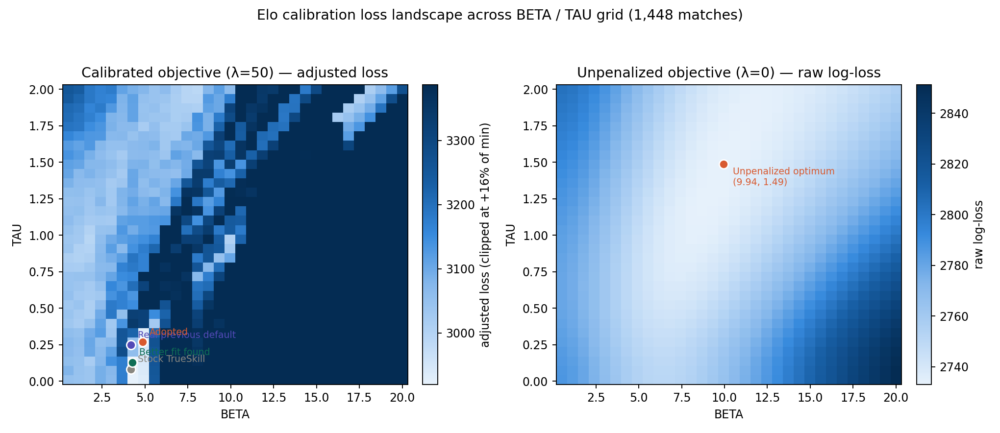

# EloTracker rating system: parameter calibration

This explains the two tunable constants behind EloTracker's skill ratings — what they do, how the current values were chosen, how they've changed over time, and what the calibration data does and doesn't support. It's written for anyone deciding whether to run this plugin as-is or retune it for their own server.

## TL;DR

- Ratings are computed with [TrueSkill](https://en.wikipedia.org/wiki/TrueSkill), a Bayesian skill-rating model. Two constants control its behavior: `BETA` and `TAU`.
- Current values: **BETA = 4.85, TAU = 0.27**, set on 2026-07-30 from a data-driven calibration against 1,448 historical matches (11,016 players).
- These replaced an earlier manually-set default (BETA = 4.17, TAU = 0.25), which itself replaced the untouched TrueSkill textbook defaults (BETA = 4.17, TAU = 0.083).
- A follow-up review found a reporting error in the original calibration writeup (details below) — corrected here. **It does not change the adopted parameter values.**

## What BETA and TAU actually do

TrueSkill tracks each player as a Gaussian belief: a mean skill estimate (`mu`) and an uncertainty (`sigma`). Two match happens, both update.

**`BETA`** — how much of a performance gap between teams gets attributed to luck/variance versus a real skill difference. It enters the win-probability calculation as added variance per player. A higher `BETA` means the model needs a *larger* skill gap before it's confident a team will win; predictions stay closer to 50/50 unless the mu difference is substantial. Set it too low and the model overreacts to noisy match outcomes; too high and it can't tell good players from bad ones.

**`TAU`** — dynamic uncertainty injected into every player's `sigma` after each match (added in quadrature: `sigma_new = sqrt(sigma² · shrink + TAU²)`, [elo-calculator.js:305](./utils/elo-calculator.js)). This is what keeps `sigma` from shrinking to zero as a player accumulates games — it's the mechanism that lets ratings keep adapting instead of ossifying. Higher `TAU` means ratings stay more reactive to recent form (useful if player skill genuinely drifts over time); too high and `sigma` never really settles, so ratings swing hard on every single match instead of converging to a stable number.

Both constants trade off responsiveness against stability. There's no context-free "correct" value — it depends on the population (how much does skill actually drift?) and on what you want the numbers to be good for (stable leaderboard vs. fast-reacting matchmaking).

## Parameter history

| Period | BETA | TAU | Source |
|---|---|---|---|
| First ~269 matches | 4.17 (25/6) | 0.083 (25/300) | Untouched TrueSkill textbook defaults |
| Next ~1,179 matches | 4.17 (25/6) | 0.25 (25/100) | Manually increased `TAU`. The historical logs confirm the switch but don't preserve the original rationale — a 3× increase in the uncertainty floor is consistent with wanting ratings to react faster to a community server's naturally shifting skill levels, but that's an inference, not a documented decision. |
| Current (2026-07-30 →) | 4.85 | 0.27 | Data-driven calibration, described below |

## How the current values were derived

**Data**: 1,448 completed matches, 11,016 distinct players. Every match had ≥3 rated players per team, so all matches were weighted equally.

**Search**: a two-pass grid search over `(BETA, TAU)` — a coarse pass (step 1.0 / 0.1) followed by a finer pass (step 0.25 / 0.02) around the coarse pass's best region — minimizing:

```
loss = raw_log_loss + λ · calibration_MSE · N
```

`raw_log_loss` is standard cross-entropy between predicted win probability and the actual outcome, replayed match-by-match. `calibration_MSE` buckets predictions into 10 probability bands (0.0–0.1, 0.1–0.2, …) and measures how far the average predicted probability in each band is from the actual win rate in that band — i.e. it penalizes *overconfidence*, not just wrong predictions. `λ = 50` sets how much calibration is weighted against raw fit.

**Why not just minimize raw log-loss alone?** We checked: with no calibration penalty (`λ = 0`), the best fit on this dataset is `BETA ≈ 9.9, TAU ≈ 1.5` — about 0.6% lower log-loss than the chosen parameters. We didn't adopt it. Concretely, `TAU ≈ 1.5` pushes the per-match uncertainty floor described above to roughly 5× higher than at `TAU = 0.27`, so ratings would never converge to a stable number — every match would produce a large swing regardless of how established a player's rating already was. And its predicted probabilities were measurably less trustworthy: calibration error was about 3.3× worse than at the chosen parameters, despite the lower raw loss. It fits this specific batch of history slightly better, at the cost of being a rating system nobody would want to actually use. `λ = 50` exists specifically to steer the search away from that trade.

## Results at the adopted parameters

| Metric | Stock TrueSkill (4.17, 0.083) | Prior production default (4.17, 0.25) | Adopted (4.85, 0.27) |
|---|:---:|:---:|:---:|
| Raw log-loss | 2758.20 | 2755.48 | 2750.81 |
| Calibration penalty (λ=50) | 163.71 | 302.71 | 179.84 |
| Adjusted loss | 2921.91 | 3058.19 | **2930.65** |
| Accuracy | 62.8% | 63.0% | 63.1% |

Against the prior production default — the parameters actually running before this calibration — calibration penalty improved roughly **1.7×** and adjusted loss improved roughly **4%**. Raw win/loss classification accuracy barely moves; the improvement is in how trustworthy the predicted probabilities are, not in picking winners more often.

### Calibration check

| Predicted P(team1 win) | Games | Actual win% | Expected range |
|---|---|---|---|
| 0.000–0.500 | 719 | 34.9% | ≤50% |
| 0.500–0.550 | 185 | 49.2% | 50–55% |
| 0.550–0.650 | 288 | 53.8% | 55–65% |
| 0.650–0.750 | 149 | 73.2% | 65–75% |
| 0.750–1.001 | 107 | 85.0% | ≥75% |

Actual win rates land within or close to their predicted bands. (Note: this table groups into 5 bands for readability; the penalty above uses 10 finer bands — treat this as a sanity check rather than a precise picture of calibration quality.)

Separately: when the post-match rating gap between teams is ≥0.5 mu, the favored team wins roughly 90% of the time — the model has real predictive signal, independent of the calibration question above.

### Loss landscape



Left: the penalized objective actually used (`λ=50`) — one broad basin around `BETA≈4–5, TAU<0.35`. Right: the unpenalized objective (`λ=0`) discussed above — a single basin around `BETA≈10, TAU≈1.5`. An interactive version with hover tooltips is included alongside this doc: `elo_calibration_landscape.html`.

## Limitations — read this before trusting these numbers on a different dataset

- **In-sample evaluation.** The parameters were chosen to minimize loss on the same 1,448 matches used to report these results — there's no held-out test set. With only two free parameters the overfitting risk is limited, but these figures describe fit quality on this dataset, not a guaranteed forward-looking accuracy number.
- **The search isn't proven globally optimal.** A follow-up check found a nearby, untested point (`BETA≈4.25, TAU≈0.13`) with marginally lower adjusted loss than the adopted values — a gap in how the two-pass search's coarse stage seeds its fine stage. The difference is small (~0.4% adjusted loss, same accuracy) and `TAU` is a real behavioral parameter, so we didn't switch on that basis, but `(4.85, 0.27)` should be read as "a good, verified point," not "the proven optimum."
- **A prior version of this document mislabeled its comparison baseline.** It compared the adopted parameters against numbers that were actually computed at the stock TrueSkill defaults evaluated under a different penalty weight than the "adopted" row — not against the real prior production default (`TAU = 0.25`) at a consistent weight. That made the reported improvement look larger than it was. The table above uses the correct baseline at a consistent penalty weight throughout, independently re-verified by re-running the calibration logic directly against the raw match data. It does not change the adopted parameter values.

## If you're evaluating this plugin for your own server

These values were fit to one Squad community's match history. If your server's population, team sizes, or skill spread look different, re-running the calibration script (`tools/elo-calibrate.js`) against your own match log is the right move rather than assuming these numbers transfer — that's exactly what produced these values in the first place.
